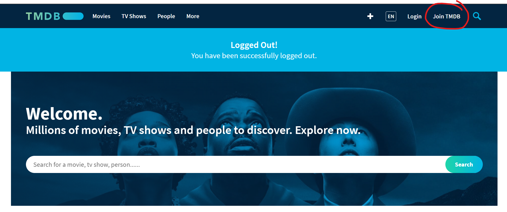
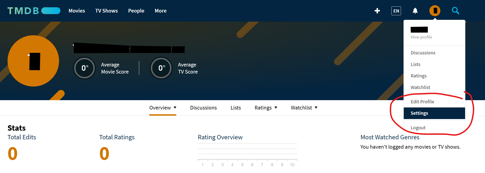
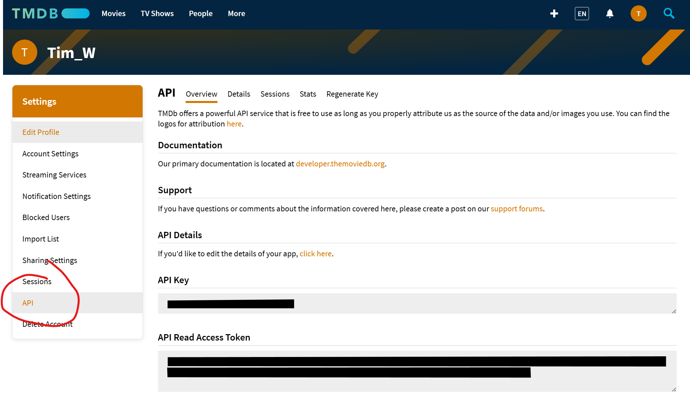

# Movie recommender system in a stream lit app
This github is part of the data science bootcamp at WBS. The project goal was recommend movies based on popularity, user or movies similar to a selected movie using a modified version of the [movielens 100k data](https://grouplens.org/datasets/movielens/).

## 1. setting up the repository locally
### 1.1 install dependencies
It's recommended to create a new virtualenv or conda environment and install the required packages inside that environment.

To install the required packages please run:

```bash
pip install -r requirements.txt
```

### 1.2 setting up your environment variables
please start with making a copy of the .env-dist file and rename it to .env. Inside the created .env file you will need to add your API from [the movie database](https://www.themoviedb.org/).

#### getting an tmdb API key
You will need to create an account on the movie database website by clicking on the **join TMDB** button in the top right.


after signing up, log into your account and go to settings


in settings go to API
> This screenshot isn't accurate! I already requested my API key, you will likely see something like along the lines of `request API key`.



> During the API key request you will asked about the purpose, here I selected `Education`, and to give a Application url. Because I had no intention of actually deploying it, I added here `http://localhost:7000`. 

You should get a confirmation email regarding your API key request and now you can find your `API Key` and `API Read Access Token` under the `API` tab of your accounts settings (as seen in the screenshot above). 
> Copy and paste the **API Read Access Token** into your created `.env` file

### 1.3 getting the data and models
#### downloading the data
create a data folder and place inside [download the data](https://drive.google.com/drive/folders/15XD0Z1Cp4pvSqm759TlYzZvLIcTGDtMq?usp=sharing)

#### download the models
create a model folder and place inside [download the models](https://drive.google.com/drive/folders/1Ick7S8owER42ZbcxnXRLq10B2XTlNcxR?usp=sharing) 

## 2. Running the streamlit app
I run the app from inside vscode using the `run Start debugging` (F5 key) or `run without debugging` (Ctrl + F5) command. 

> Running the streamlit app from the terminal caused `Invalid API key` errors as the API variables in the .env file aren't accessed.
> 


